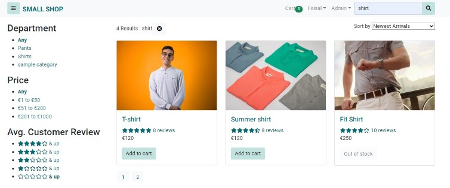
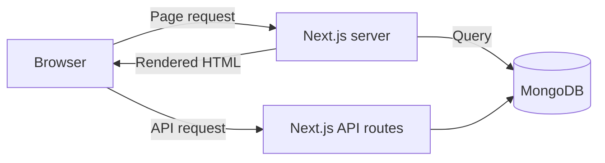
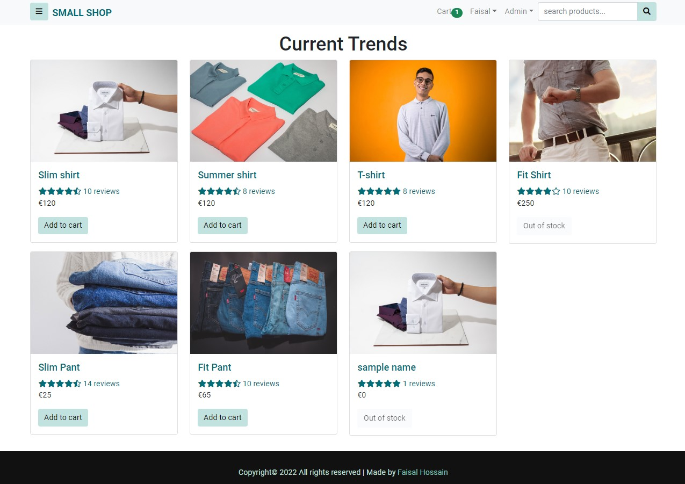

# Small Shop - Server-Side Rendering (SSR)

Small Shop is a full-stack e-commerce prototype built as the Server-Side Rendering implementation. It uses Next.js to render key pages on the server and provides backend functionality through Next.js API routes and MongoDB.



## Thesis context

My thesis compares three approaches to modern web development by implementing the same e-commerce application three times:

| Approach | Application | Rendering strategy | Repository |
| --- | --- | --- | --- |
| SPA | Tiny Shop | The browser renders the interface after loading the JavaScript application | [View SPA implementation](https://github.com/fhjoy/spa) |
| **SSR** | **Small Shop** | **The server renders HTML for each request** | **This repository** |
| SSG | Little Shop | Pages are pre-rendered during the build | [View SSG implementation](https://github.com/fhjoy/ssg) |

The three applications intentionally have closely matched features and visual designs. This keeps the application domain and user interface stable so that the rendering strategy remains the main comparison variable.

The comparison considers flexibility, performance, data fetching, security, learning curve, popularity, and SEO.

[View the thesis poster](https://github.com/fhjoy/spa/blob/master/docs/thesis-poster.pdf)

## How the SSR version works

Next.js runs `getServerSideProps()` for key catalogue and detail pages. The server reads the required data from MongoDB, renders the React page to HTML, and sends the completed document to the browser. Interactive actions continue on the client and communicate with Next.js API routes.



## Screenshots

### Product catalogue



### Search, filtering, sorting, and pagination


## Features

- Server-rendered product catalogue and product detail pages
- Search, category filtering, rating filtering, sorting, and pagination
- Shopping cart with stock validation
- User registration, sign-in, profile management, and order history
- Shipping, payment, order review, and checkout workflow
- PayPal payment integration
- Product ratings and customer reviews
- JWT-based authentication
- Admin dashboard with sales summary charts
- Product, order, and user administration
- API routes for products, users, orders, reviews, payments, and seed data
- MongoDB persistence through Mongoose models

## Technology stack

| Area | Technologies |
| --- | --- |
| Framework | Next.js 11, React 17 |
| Rendering | Server-Side Rendering with `getServerSideProps()` |
| Interface | Material UI, Emotion |
| Backend | Next.js API routes, next-connect |
| Data | MongoDB, Mongoose |
| Authentication | JSON Web Token, bcrypt.js, cookies |
| Payments | PayPal React SDK |
| Forms and feedback | React Hook Form, Notistack |
| Admin analytics | Chart.js |

## Local setup

### Prerequisites

- Node.js and npm
- Local MongoDB or a MongoDB Atlas connection
- Optional PayPal sandbox client ID

### 1. Clone the repository

```bash
git clone https://github.com/fhjoy/ssr.git
cd ssr
```

### 2. Configure environment variables

Create `.env.local` in the project root:

```env
MONGODB_URI=mongodb://localhost/small-shop
JWT_SECRET=replace_with_a_private_secret
PAYPAL_CLIENT_ID=your_paypal_sandbox_client_id
```

### 3. Install and start the application

```bash
npm install
npm run dev
```

Open `http://localhost:3000`.

### 4. Seed sample data

Open `http://localhost:3000/api/seed` once before exploring the application.

Development accounts:

| Role | Email | Password |
| --- | --- | --- |
| Administrator | `admin@example.com` | `123456` |
| Customer | `user@example.com` | `123456` |

These credentials are for local demonstration only.

### Production build

```bash
npm run build
npm start
```

## SSR characteristics explored

### Strengths

- Complete HTML is generated for each request
- Public pages expose meaningful content before client-side JavaScript runs
- Dynamic product data can be fetched immediately before rendering
- Server-rendered content supports SEO and link previews

### Trade-offs

- Every server-rendered request requires server computation and data access
- Response time depends on backend and database performance
- Rendering and application infrastructure are more tightly connected
- Effective caching requires deliberate configuration

## Project status

This repository is an academic prototype created in 2022 for a controlled architecture comparison. It is preserved as evidence of the implementation and research process, not as a production storefront. Dependencies should be reviewed and upgraded before production use.
